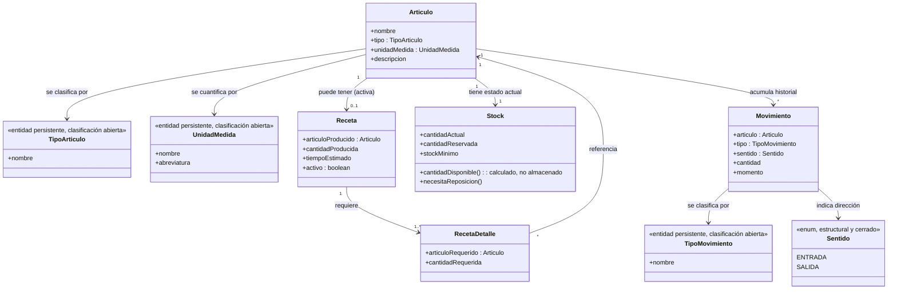
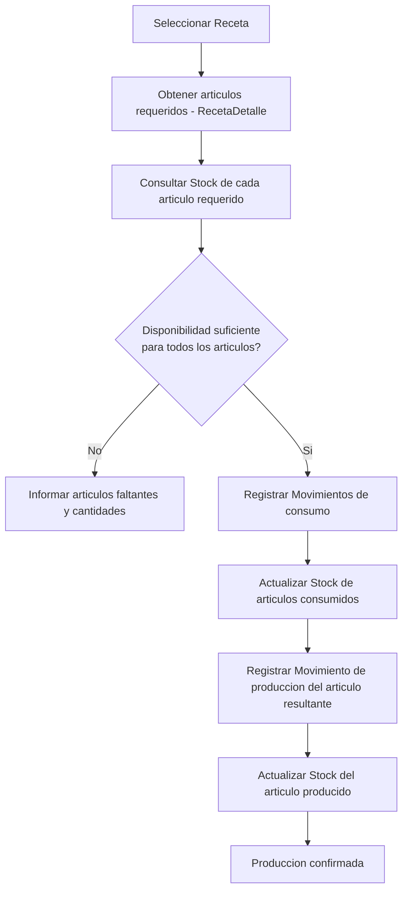
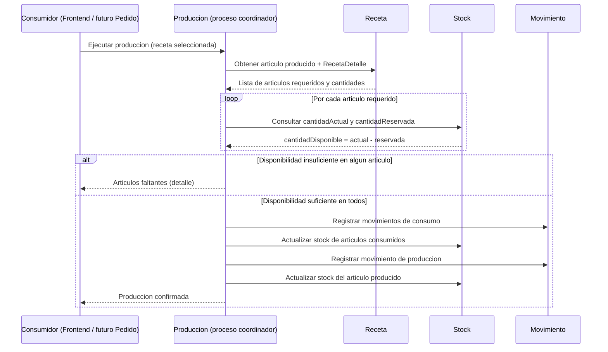
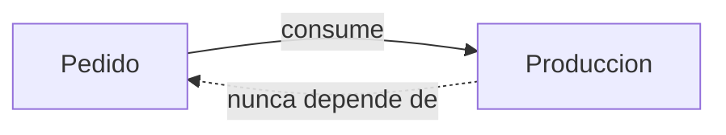

# Módulo Producción — Contrato de Dominio

Versión: 1.0
Estado: Diseño de dominio (pre-implementación)
Tipo de documento: Fuente de verdad funcional y técnica

---

## 1. Propósito de este documento

Este documento define el modelo de dominio del módulo **Producción** antes de escribir una sola línea de código. Es el contrato que deben respetar:

- Backend (implementación futura).
- Frontend (consumo futuro).
- Futuras integraciones (Pedido, Compras, Reportes).
- Nuevos desarrolladores que se incorporen al proyecto.
- Inteligencias artificiales que asistan en el desarrollo.

Cualquier implementación posterior debe ser consistente con lo aquí definido. Si la implementación necesita desviarse de este contrato, el contrato debe actualizarse primero, y esa actualización debe ser explícita y justificada.

Este documento prioriza el entendimiento del negocio por sobre el detalle técnico. No contiene clases, controladores, repositorios ni DTOs.

---

## 2. Contexto de negocio

Producción representa la **fabricación interna de artículos** dentro del restaurante: qué se necesita para producir algo, si hay recursos suficientes para hacerlo, y qué ocurre con el inventario cuando la producción se ejecuta.

Este módulo existe para responder, en todo momento, seis preguntas de negocio:

1. ¿Puedo producir este artículo?
2. ¿Qué artículos necesito?
3. ¿Qué artículos faltan?
4. ¿Qué stock será consumido?
5. ¿Qué movimientos deben registrarse?
6. ¿Cuál será el nuevo estado del stock?

Todo lo demás (quién pide, quién paga, quién entrega) es responsabilidad de otros módulos.

---

## 3. Independencia respecto al módulo Pedido

**Producción no conoce a Pedido.** Esta regla no es una preferencia de diseño, es un límite arquitectónico obligatorio.

- Pedido se desarrollará después y **consumirá** Producción como cliente.
- Producción nunca importa, referencia ni depende de ningún concepto de Pedido.
- La relación es unidireccional: `Pedido → Producción`. Nunca al revés.

Esto convierte a Producción en un módulo reutilizable por cualquier consumidor futuro (Pedido, Compras, un panel administrativo, un proceso batch), sin acoplarse a las necesidades particulares de ninguno de ellos.

---

## 4. Responsabilidades del módulo

### Qué SÍ hace

- Modela qué es un artículo y cómo se clasifica.
- Modela cómo se transforma un conjunto de artículos en otro artículo (receta).
- Modela el estado actual del inventario (stock).
- Modela el historial de hechos que afectaron el inventario (movimientos).
- Determina disponibilidad para producir.
- Coordina el proceso completo de producción: verificación → registro de movimientos → actualización de stock.

### Qué NO hace

- No sabe qué es un pedido, una mesa o un cliente.
- No calcula costos ni precios.
- No gestiona compras a proveedores.
- No gestiona lotes ni vencimientos.
- No soporta producción parcial ni asincrónica.
- No modela "órdenes de producción" como registro persistente (ver sección 6.8).

---

## 5. Glosario y modelo de dominio

### 5.1 Artículo

Representa **cualquier elemento administrado por el sistema**. Es el concepto central del módulo — toda la producción gira alrededor de él.

Un artículo puede representar, entre otros:

- Ingrediente
- Preparación
- Producto
- Envase
- Descartable
- Cualquier otro recurso administrado por el sistema

**Atributos conceptuales:** identidad, nombre, tipo (`TipoArticulo`), unidad de medida (`UnidadMedida`, obligatoria — todo artículo se cuantifica de alguna forma, aunque sea "UNIDAD"), descripción (opcional), `activo` (booleano, default verdadero), `fechaCreacion`.

**Invariante clave:** un artículo puede tener o no una receta asociada. Si no tiene receta, no puede producirse dentro del sistema — solo puede ingresar por otras vías (por ejemplo, compra, aunque eso es de otro módulo).

**Desactivación (ADR 0001, sección 15):** un artículo nunca se elimina físicamente. `activo = false` lo oculta de la operación diaria y bloquea nuevas operaciones de inventario sobre él, pero preserva intactas sus recetas y movimientos, y permite reactivarlo.

**Bloqueo de `unidadMedida` (ADR 0001, sección 16):** solo puede modificarse mientras el artículo no tenga stock físico ni movimientos registrados. Una vez que existe historial de inventario, queda bloqueada — no hay conversión automática entre unidades.

### 5.2 TipoArticulo

Clasifica un artículo. **No contiene lógica de negocio**, es puramente descriptivo.

No se define como una lista cerrada y definitiva en esta etapa — los ejemplos dados (Ingrediente, Preparación, Producto, Envase, Descartable) son los tipos identificados hoy, pero el concepto debe permitir incorporar nuevos tipos sin rediseñar el dominio.

**Decisión de modelado:** `TipoArticulo` se implementa como una **entidad persistente** (no como un enum de código), precisamente para que agregar un tipo nuevo sea un dato nuevo y no un cambio de código. Los valores iniciales conocidos (Ingrediente, Preparación, Producto, Envase, Descartable) se cargan mediante un script de datos (seed) — en esta etapa no existe un caso de uso para crear tipos en tiempo de ejecución; queda diferido a una etapa posterior.

### 5.2.1 UnidadMedida

Clasifica cómo se cuantifica un artículo (peso, volumen, unidades). Mismo tratamiento que `TipoArticulo`: **entidad persistente**, clasificación abierta, cargada por seed (`GRAMO`, `KILOGRAMO`, `MILILITRO`, `LITRO`, `UNIDAD`, cada una con una `abreviatura` para mostrar en UI, ej. "kg"). Ver ADR 0001, sección 12.

### 5.3 Receta

Representa una **transformación**: un conjunto de artículos se convierte en otro artículo.

**Reglas estructurales:**

- Una receta siempre produce **exactamente un** artículo. Nunca múltiples. Esta es una regla de negocio no negociable.
- Una receta puede **consumir múltiples** artículos (a través de `RecetaDetalle`).
- Una receta conoce: qué artículo produce, cuánto produce, cuánto tiempo tarda.
- **Un artículo solo puede ser producido por una única receta activa a la vez.** Para sostener esto sin perder historial, `Receta` tiene un atributo `activo`: al reemplazar la forma de producir un artículo, la receta anterior se desactiva en lugar de eliminarse, y se crea una nueva receta activa para ese artículo. La invariante de unicidad ("una única receta activa por artículo") se valida solo entre recetas activas.
- `Receta` también tiene `fechaCreacion` (ADR 0001, sección 18).

**Lo que una receta explícitamente NO hace:**

- No conoce el stock.
- No genera movimientos.
- No valida disponibilidad.

Es una definición estática de "cómo se fabrica algo", no un proceso ejecutable por sí misma.

### 5.4 RecetaDetalle

Describe cada uno de los artículos necesarios para ejecutar una receta.

**Atributos conceptuales:** artículo requerido, cantidad requerida.

Una receta tiene una colección de `RecetaDetalle` (cero o más — en la práctica, al menos uno para que la transformación tenga sentido, aunque el documento no impone ese mínimo como regla dura todavía).

### 5.5 Stock

Representa el **estado actual** de un artículo. No representa historia, representa una fotografía del presente.

**Administra:**

- `cantidadActual`
- `cantidadReservada`
- `stockMinimo` — umbral configurado por el usuario al crear o editar el artículo. Es una configuración permanente del inventario, no un dato de un movimiento puntual (ver ADR 0001, sección 13).

**Regla de cálculo (no de almacenamiento):**

```
cantidadDisponible = cantidadActual - cantidadReservada
```

`cantidadDisponible` **nunca se almacena**. Se calcula siempre a partir de los dos valores anteriores. Persistirla generaría una fuente de verdad duplicada y abriría la puerta a inconsistencias.

**Comportamiento:** `necesitaReposicion()` — `cantidadActual < stockMinimo`. Es la única forma de evaluar el umbral; no existe un segundo método con la misma regla bajo otro nombre (evita duplicar lógica de negocio).

**Invariante clave:** el stock nunca depende de la receta. El stock es un hecho de inventario; la receta es una definición de fabricación. Son conceptos ortogonales.

### 5.6 Movimiento

Representa un **hecho ocurrido** sobre el inventario. No representa el estado — representa el historial.

**Atributos conceptuales:** artículo afectado, tipo de movimiento, **sentido** (entrada o salida), cantidad (siempre positiva), momento en que ocurrió.

**Regla clave:** todo cambio de stock debe estar respaldado por al menos un movimiento. El stock actual debería ser, conceptualmente, reconstruible a partir de la suma de sus movimientos — aunque en esta etapa el stock se mantiene como entidad propia por razones de performance de consulta, no como un mero agregado calculado en tiempo real.

**Sentido (ENTRADA / SALIDA):** un mismo `TipoMovimiento` (por ejemplo, Producción) puede sumar o restar `cantidadActual` según el caso — producir un artículo genera un ingreso del artículo resultante y, a la vez, una salida de cada insumo consumido. `sentido` es el atributo que distingue esto, ortogonal a `tipo`. A diferencia de `TipoArticulo`/`TipoMovimiento`, `sentido` es un concepto estructural y cerrado (siempre son dos valores posibles), no una clasificación de negocio que deba extenderse — se modela como un enum de código.

### 5.7 TipoMovimiento

Clasifica un movimiento. Tipos identificados en esta etapa:

- Producción
- Compra
- Ajuste
- Desperdicio
- Reserva
- Liberación
- Alta — ingreso inicial de stock al crear un artículo (caso de uso Crear Ingrediente). Distinto de Ajuste (corrige algo existente) y de Compra (operación comercial no modelada todavía).

Al igual que `TipoArticulo`, este conjunto es el identificado hoy y no se asume cerrado a futuro.

**Decisión de modelado:** al igual que `TipoArticulo`, `TipoMovimiento` se implementa como **entidad persistente**, no como enum, con los mismos valores iniciales cargados por script de datos y sin caso de uso de alta en esta etapa.

### 5.8 Producción (el proceso coordinador)

> **Nota de diseño:** "Producción" no es una entidad persistente ni un agregado en esta etapa. No existe un objeto `OrdenDeProduccion` que se guarde en base de datos — eso está explícitamente fuera de alcance (sección 8). Producción es el **proceso de dominio** (comparable a un domain service) que orquesta a `Receta`, `Stock` y `Movimiento` para responder las seis preguntas de negocio de la sección 2 y ejecutar el flujo de la sección 7.

Esta distinción es importante: si en una etapa futura se necesita trazabilidad de "quién ejecutó qué producción y cuándo" más allá de los movimientos individuales, eso implicaría promover Producción de proceso a entidad (una futura "Orden de Producción"). Esa decisión se difiere intencionalmente y no debe asumirse como parte de esta versión del contrato.

**Responsabilidad exclusiva de Producción:** es la única pieza del dominio autorizada a modificar Stock y generar Movimientos como consecuencia de fabricar algo. Ni Receta ni Stock se modifican a sí mismos en este flujo.

---

## 6. Diagrama del modelo de dominio



**Nota sobre composición multinivel (pregunta abierta, no resuelta en esta versión):** dado que un `Articulo` de tipo Preparación puede a su vez tener su propia `Receta`, es posible que un `RecetaDetalle` requiera un artículo que, si no hay stock suficiente, podría producirse ejecutando su propia receta (fabricación en cadena). Este documento **no** decide todavía si esa resolución en cadena es responsabilidad de esta primera versión de Producción o si el proceso, en esta etapa, se limita a un solo nivel (verificar disponibilidad de los artículos requeridos tal cual están en stock, sin intentar fabricarlos recursivamente). Se deja marcado como decisión pendiente para no asumir un requisito no confirmado.

---

## 7. Flujo principal de producción

### 7.1 Descripción conceptual

1. **Seleccionar una receta** — el punto de entrada siempre es "quiero producir el artículo que esta receta produce".
2. **Obtener los artículos requeridos** — se leen los `RecetaDetalle` de la receta seleccionada.
3. **Consultar el stock de cada artículo** — para cada artículo requerido, se calcula su `cantidadDisponible`.
4. **Determinar disponibilidad** — se compara la cantidad disponible de cada artículo contra la cantidad requerida.
5. **Informar artículos faltantes cuando corresponda** — si algún artículo no tiene disponibilidad suficiente, el proceso se detiene ahí y se reporta el detalle de qué falta y cuánto.
6. **Si hay disponibilidad suficiente para todos los artículos:**
   - Se registran los movimientos de consumo (uno por artículo consumido, tipo `Producción` o el que corresponda).
   - Se actualiza el stock de cada artículo consumido.
   - Se genera el artículo producido: se registra su movimiento de producción y se actualiza su stock.

Este flujo es **todo o nada**: no existe producción parcial. Si falta disponibilidad de un solo artículo requerido, no se ejecuta ningún cambio de stock ni movimiento para ninguno de los artículos de esa receta.

### 7.2 Diagrama de flujo



### 7.3 Diagrama de secuencia



---

## 8. Fuera de alcance en esta etapa

Explícitamente, este módulo **no** contempla todavía:

- Pedidos
- Clientes
- Compras
- Usuarios
- Pagos
- Lotes
- Vencimientos
- Costos
- Producción parcial
- Producción asincrónica
- Órdenes de Producción (como entidad persistente)

Estos conceptos pertenecen a otros módulos o a futuras etapas del roadmap del proyecto. Si una necesidad futura obliga a tocar alguno de estos puntos, este documento debe revisarse y versionarse antes de implementar el cambio.

---

## 9. Límites arquitectónicos (bounded context)

### Qué expone Producción hacia otros módulos

- Consulta de artículos (existencia, tipo, si tiene receta).
- Consulta de recetas (qué produce, qué requiere).
- Consulta de stock (disponibilidad de un artículo).
- Consulta de disponibilidad de producción (¿puedo producir este artículo, y con qué faltantes si no?).
- Ejecución de producción (dispara el flujo de la sección 7).
- Consulta de historial de movimientos de un artículo.

### Qué permanece encapsulado

- El mecanismo interno de cálculo de `cantidadDisponible` (los consumidores nunca calculan esto por su cuenta; siempre lo piden a Producción).
- La forma en que se generan y ordenan los movimientos durante una ejecución de producción.
- Los detalles de persistencia de cualquiera de estas entidades.

### Regla de dependencia



Producción no conoce, ni debe llegar a conocer, ningún concepto de Pedido, Cliente, Pago, etc. Su única "vista hacia afuera" es la que expone deliberadamente en la lista anterior.

---

## 10. Comunicación con Frontend

En esta etapa se definen **capacidades funcionales**, no endpoints ni contratos HTTP. El frontend necesitará poder:

- **Consultar artículos** — listar y ver detalle de artículos administrados por el sistema.
- **Consultar recetas** — obtener qué artículo produce una receta y qué artículos/cantidades requiere.
- **Consultar stock** — ver el estado actual (cantidad actual, reservada y disponible) de un artículo.
- **Consultar disponibilidad de producción** — antes de ejecutar, saber si una receta puede producirse hoy y, si no, qué falta y en qué cantidad.
- **Ejecutar producción** — disparar el flujo completo de la sección 7 para una receta dada.
- **Consultar historial de movimientos** — ver qué hechos de inventario ocurrieron sobre un artículo (necesario para justificar por qué el stock está en su estado actual).

Estas capacidades son la base sobre la que, en una etapa posterior, se diseñarán los endpoints REST concretos — pero esa decisión no corresponde a este documento.

---

## 11. Relación con el roadmap del proyecto

Según `roadmap.md`, el proyecto avanza en fases (Fase 2: Core restaurante, Fase 5: Inventario). Producción es un módulo transversal que sienta las bases de dominio de inventario/fabricación necesarias antes de que Pedido (Fase 2) pueda consumir disponibilidad real de productos, y antes de que Inventario (Fase 5) se desarrolle en profundidad (compras, proveedores). Este documento no reordena el roadmap — documenta el contrato de un módulo cuyo desarrollo se está adelantando por necesidad de diseño.

---

## 12. Estado del documento

Este es un documento vivo. Cambios en las reglas de negocio, el modelo o el alcance deben reflejarse aquí **antes** de reflejarse en código. Cualquier decisión marcada como "pendiente" en este documento (ver sección 6, composición multinivel) debe resolverse explícitamente — con análisis de alternativas y trade-offs — antes de comenzar la implementación de esa parte del dominio.
